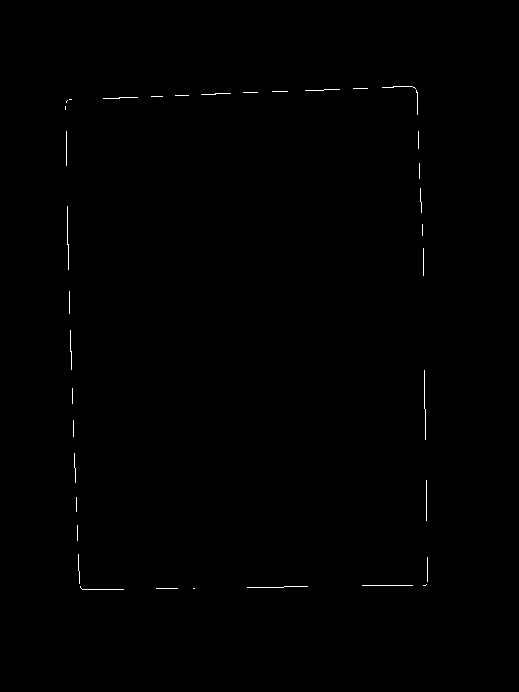
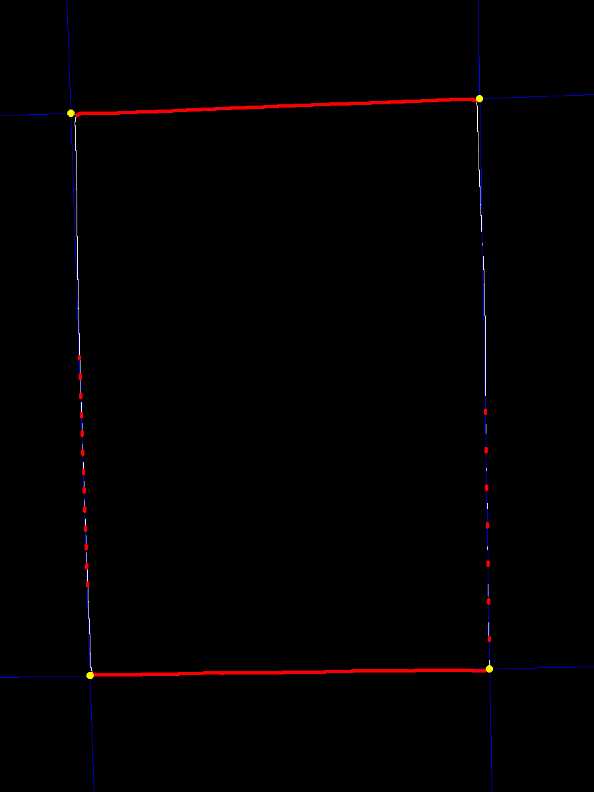
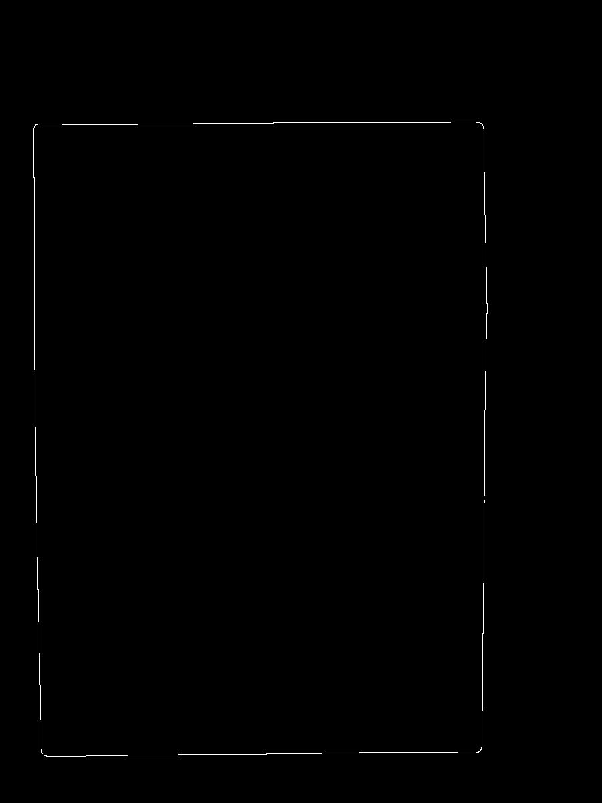

# Final Project

16340028 陈思航

Github:https://github.com/chensh236/ComputerVisionFinalProject

## 题目

普通A4打印纸，包含如下信息：

- 学号
- 手机号
- 身份证号

根据标准流程输出每一个主要步骤的结果，包括A4纸矫正的结果、行数据的切割、单字符的切割结果。对上面的 A4 纸的四个角、学号、手机号、身份证号进行识别, 识别结果保存到Excel 表格(xlsx 格式), 对于手写体数字字符的训练数据可以使用 MNIST。

## 第一部分 图像处理与分割

这一部分引用了之前作业的内容，首先需要通过高斯模糊对出现进行预处理以避免A4纸中的文字对边缘分割的影响。

### 高斯模糊

高斯滤波的作用在于消除噪声。因为噪声集中于高频信号，而且非常容易在sobel滤波过程中干扰边缘的识别。故通过高斯滤波消除噪声。

在二维图像中，高斯分布为
$$
G(x,y)=\frac{1}{2\pi\sigma^2}e^{-\frac{x^2+y^2}{2\sigma^2}}
$$
在实现过程中，可以直接调用`cimg`中的高斯模糊函数直接实现，只需要输入$\sigma$即可。比较后面的实现高斯模糊非常简单所以不过多赘述。

#### 优势与劣势

高斯滤波器是低频滤波器，可以滤去高频的细节成分，只保留低频的颜色等信息。对于纸张内的文字可以较好的消去。但是使用高斯滤波器同时也滤去了一些边缘信息，导致边缘变形不再是正常的矩形。对于边缘的变形需要在Hough空间设置投票阈值进行处理。

### K-means进行图像分割

K-means相比较于OTSU以及迭代法更不受光线的影响，可以较好对图像进行分割。在识别A4纸的时候，一般图像的中点都会位于纸张内，所以K-means一开始的点设置在图像的中点，以提高迭代的速度。同时，通过对图像进行灰度化处理以减少2-范式距离的运算量，提高计算速度。

#### K-means实现过程

- 随机初始化k个聚类中心。但是在实际实验过程中出现了因为聚类中心的选取不同导致二值化后图像中纸张黑白不统一（有黑有白），对于后面的处理不友好，所以直接选取中心点和边缘点作为两个聚类中心。
- 计算每个样本与每个聚类中心之间的灰度值的欧式距离（2范式），将样本划分到最相似的类别中.
- 计算划分到每个类别中的所有样本特征的均值，将该均值作为每个类新的聚类中心。
- 重复步骤2-3，直到聚类中心不再改变。 

在这次实验中，类别的数量是2，即有$K = 2$。通过K-means，可以保留前景的像素以及背景的像素。而其中每一点到聚类中心的RGB值的欧式距离作为分类的依据。划分完成后得到二值图像，前景为白色后景为黑色。

#### DFS对纸张进行遍历

为了避免多张图像的干扰，这里通过DFS对纸张进行遍历，将无法到达的点作为干扰信息进行黑化处理。对于手写识别场景，用户不可能将识别的A4纸放置边缘而干扰的A4纸放置中央，所以起始点挑选在中央，以提高准确率。

#### 马尔科夫邻域边缘提取

因为图像分割后的二值图像中前景像素和背景像素边缘非常明显，所以可以直接利用马尔科夫领域进行边缘的检测和提取。具体过程如下：

- 创建副本图像，像素值均初始化为0。
- 如果二值图中的前景像素，如果其马尔科夫邻域中出现有黑色像素，则将其值复制到副本图像中的相应位置。

#### 优势与劣势

在之前的实验中进行滞后边缘处理以处理文字信息的干扰因素。这是因为没有使用DFS算法对纸张进行遍历去除干扰的因素，导致高斯模糊的theta值不能过高以免影响图像的分割。但是通过DFS算法进行纸张遍历后，可以不使用滞后边缘处理直接可以提取边缘，提高计算效率。对于K-means以及DFS算法，都默认图像中央为需要识别的纸张，这样虽然提升了计算的速率，但是如果用户恶搞性不将图片放置中央，那么对识别效果有一定的影响。


### Hough变换检测直线的过程

Hough变换是图像变换的常用的方法，可以从图像中分离出具有相同特征的几何形状，通过霍夫变换可以在减少噪声干扰下识别几何图形。在这次实验中被用于检测直线和圆形。

对于直线检测，每一个像素点，把可能经过它的所有的直线映射到Hough空间中，再进行投票。在进行直线表示的时候，受制于垂直于x轴直线斜率不存在的限制，使用参数方程
$$
r = x × cos(\theta) + y × sin(\theta)
$$
对直线进行表示。其中的x和y分别是像素点的坐标，r是经过该点直线到原点的距离，theta则表示直线r与x轴的正方向的夹角。从而可以用r和theta表示的Hough空间。进行投票即是对于每一个像素点进行映射之后，在Hough空间中相应像素点票数都加上1。

在进行投票操作之后，通过预先设定的阈值可以求出局部的最大值，从而得到若干条直线的参数方程表示。因为进行A4纸的边缘识别，所以只能有4条直线。阈值的设置变得非常重要，因为阈值过低造成直线数量增加，阈值过高造成直线数量减少。

#### 优势与劣势

Hough变换可以通过投票从图像中分离出具有相同特征的几何形状，效率高而且准确率不错。但是通过图像分割提取的边缘信息并不是完美的矩形，而是有一定的变形。而Hough变换分离出的直线是正常的直线，通过Hough变换分离出直线获得的角点可能有一定的误差，这可能导致图像变换的时候出现一定的变形。


### 图片变换

##### 角点顺序的确定

Hough变换后确定的角点是乱序的，所以需要对角点按照顺时针的顺序进行排序。排列的过程如下：

- 对角点进行遍历，找出距离最小的两对角点（不能重复）。
- **无论横向还是纵向摆放**，y值较小的一对在上面，较大的在下面，如果颠倒恢复顺序。
- 对于恢复了顺序的两个对，需要对它们内部进行排序。左边点的x值小于右边。如果顺序颠倒则恢复。

通过这种排序方式，可以获得顺时针顺序的角点。

##### DLT求解Homography矩阵H

> **单应(Homography)**是射影几何中的概念，又称为射影变换。它把一个射影平面上的点(三维齐次矢量)映射到另一个射影平面上，并且把直线映射为直线，具有保线性质。总的来说，单应是关于三维齐次矢量的一种线性变换，可以用一个3×3的非奇异矩阵HH表示：
> $$
> x1=Hx2
> $$
> 这是一个齐次坐标的等式，HH乘以一个非零的比例因子上述等式仍然成立，即HH是一个3×3齐次矩阵，具有8个未知量。
>
> 假设已经取得了两图像之间的单应，则可单应矩阵HH可以将两幅图像关联起来。

Homography矩阵H是一个3×3的矩阵，用于拟合两个图像间特征匹配的关系。
$$
x'=Hx => x'×Hx =0\\
\begin{pmatrix}

     u \\

     v\\
     1

\end{pmatrix}
=
H
\begin{pmatrix}

     x \\

     y\\
     1

\end{pmatrix}
$$
对于一对A4纸的角点可以作为特征点可以通过单应矩阵进行映射变换，对于Homography单应性矩阵，有如下的定义：
$$
\begin{bmatrix}

     H_{11} & H_{12} & H_{13} \\

     H_{21} & H_{22} & H_{23} \\
     H_{31} & H_{32} & 1 \\

\end{bmatrix}
$$
在矩阵H中，除了最后一个元素为1，其他元素都是未知的，所以一共有8个未知的参数，需要四组特征点（A4纸的角点）进行计算。在实验中，可以直接`cimg`的`get_solve`进行求解。

#### 图像的旋转变换

利用H矩阵，可以将待拼接的图像旋转变换到新图像上，而对于另一张图像，只需要进行平移即可。在新的图像上，这两两张图像就叠加在一起了。


与投影类似，因为无法保证新的图像上的所有的点都被一一映射到，所以需要通过双线性插值对没有被旋转图像映射到的点通过邻域进行像素值计算。

#### 双线性插值

对于上述的计算过程，可能无法实现目标图像到源图像的一一映射，即X’的值不可能恰好就是原图像像素点的位置，因此通过双线性插值实现帧图像像素点颜色值的补全。双线性插值的核心思想是在两个方向分别进行一次线性插值。

即对于$S(x, y)$，有
$$
S(x, y) = (1-a) ×(1-b)×S(i, j) + a ×(1-b)×（i+1，j）\\ + (1-a)×b×S(i,j+1) + a×b×S(i+1, j+1)
$$
通过图像的旋转变换与双线性插值，便可以实现A4纸的变换。

## 第二部分 图像的旋转与字符分割

### 图像预处理

对于分割完的图像，需要通过二值化处理。由于光线的不均匀，不能直接通过全局设置阈值处理。但如果将图像进行分块，在每一块通过OTSU进行二值化处理，虽然说OTSU受到光照影响，每一小块的变化不是很大，所以受到不均匀光线的影响比较小，效果也比较不错（除了极个别噪点挺干净的）。

#### 分块

通过自己设定每行和每列的块的数量，得到块的大小以及剩余L形的剩余。对于该剩余部分依然按照行和列进行分块操作。对于边缘进行Padding填充操作，填充白色以避免前面Warping误差造成的黑边。

#### OTSU

对于每一块通过OTSU获得合适的阈值。高于阈值设为255否则为0。

OTSU大律法算法过程如下（引自维基百科）：

> 1. 计算每个强度级的直方图和概率；
> 2. 设置$w_i(0)$和$u_i(0)$大小；
> 3. 遍历所有阈值，大恶道最大强度，更新上面的两个值，计算均方差；
> 4. 所需的阈值有最大的均方差。

这样得到的阈值可以将小块图像进行二值化处理而避免光照不均的影响。

#### 形态学处理以及块的舍弃

##### 第一次舍弃

虽然经过OTSU得到的阈值进行处理可以避免一定程度的光照不均匀影响，但是小块图像的灰度值变化不大，特别是没有字的部分会因为OTSU强行分为两部分，产生了噪点。对于这些噪点，首先通过设定一个较高的阈值进行去除。方法就是对黑色像素所占的比例进行判断。对每一小块进行遍历，如果黑色像素比例大于百分之六十，进行舍弃操作，填充为白色。

##### 膨胀

因为有些同学书写习惯实在不好，字特别细所以在分割的时候出现了问题。所以通过膨胀对黑色像素（字体与部分噪点）进行处理。一来字粗了下一步进行字符分割的时候更方便，二来黑色噪点变多变密了可以进行第二次较低阈值的块舍弃。

##### 第二次舍弃

刚才提到的，噪点会因为膨胀变得更大更密，所以再次设定阈值可以舍弃噪点得到干净的图像。这次的阈值应该比上次低，避免将字符填充成白色，影响判断。

#### 优势与不足

进行图像的分块处理确实可以避开全局阈值分割效果不好的坑，但是分割块的大小很大取决于字体的大小。在没有分割出字符之前，无法获得字体的确切大小；而没有进行分块阈值操作，也就没法进行字符的分割。这似乎是一对矛盾。经过多次尝试获得适用性较好的块大小和舍弃的阈值。但是这样的参数适用10张图可能不适用100张图，为下一部分实验可能埋下隐患。而对大律法，无法像迭代一样设置初始的参数影响其结果阈值，OSTU获得的阈值准确性只能靠算法本身而无法通过调整参数进行优化。


### 图像的旋转

在群里问过老师如何实现图像的旋转，老师回答使用拉冬变换。但是在进行项目完成的过程中，尝试通过拉冬变换对灰度图、二值化图进行操作，效果都极其一般，效果时好时坏。于是决定通过形态学处理与Hough变换结合获得旋转的角度，发现效果不错。

#### 横向膨胀与纵向腐蚀

如何进行旋转角度的判断，是图像正确旋转的本质问题。首先，通过canny算法最后的之后边缘处理去除其中的某些字符，以减少较大字符带来的宽度过大的直线。其次对图像中的字符进行横向膨胀（20+次），之后进行纵向腐蚀（4+次）。这样可以得到图像所在一行的大致直线信息。

#### Hough变换与投票

这一部分与之前的Hough变换一致，只是不设定投票阈值，而且在投票后直接找出Hough变换后整张图的最大值，对应的theta值作为图像旋转的theta值。

对于该theta值，原本以为恰好是旋转的角度，但发现总是与真实角度相差90度。处于工程学的考虑，先将角度减去90度再通过实验验证其正确性。通过多次拍取图片并进行实验，发现确实Hough变换后theta值跟真实图像所需要旋转的角度相差90度。于是，直接将相减结果的theta值作为结果进行旋转处理。

#### 利用双线性插值进行图片的旋转操作

双线性的部分前面已经讲过，这里只讲图片的旋转操作。

因为之前的theta值是相对于水平线的，所以该theta值可以用于以图像中点为旋转原点进行图片的旋转操作。通过原来的点(x0, y0)与变换后的点(x1, y1)：
$$
x_0=rcos(B−A)=rcosBcosA+rsinBsinA \\
y_0=rsin(B−A)=rsinBcosA−rsinAcosB \\
x_1=rcosB\\
y_1=rsinB
$$
可以得到：
$$
x_0=x_1cosA+y_1sinA\\
y_0=y_1cosA−x_1sinA
$$
对于该后向映射，可以反求得：
$$
x_1=x_0∗cosA−y_0∗sinA\\
y_1=y_0∗cosA+x_0∗sinA
$$
对于该(x1, y1)，因为不是整数，所以通过双线性插值可以求出其对应位置的像素值。

#### 优势与不足

这种旋转的方法简单有效，而且可以复用之前Hough变换的代码，使得实现更加容易，但是完全是处于工程学考虑，没有想到其对应的数学解释，就如同后面的CNN的滤波器大小设置一样，只是因为效果好而使用。TA看到结果可能会说效果并不是很好，还是有一定的角度。这是因为之前在预处理的时候进行了膨胀处理，即使通过滞后边缘检测去掉了较大的字符，但获得的直线依然较粗，影响了结果。如果不进行二值化后的膨胀处理，旋转结果准确很多

### 字符分割

#### 横向分割

##### 直方图

如果旋转角度合适，横向分割是比较简单的。首先对于每一行像素进行扫描，统计黑色像素的数量。如果小于阈值置为0。一次遍历后可以获得y方向的直方图。

##### 第一次舍弃

为了避免噪点的影响，对于y方向的直方图再次进行遍历，如果直方图的两个波谷的距离小于阈值，置为0，相当于舍弃该行的图像。这种方法对于一些较瘦长形状的噪点比较有效。

##### 获得分割线

对于处理后的灰度直方图，对每一个波谷获得一根分割线。即如果上一行直方图值为0而下一行不为0则画一条横线；如果上一行不为0而下一行为0也画一条横线。这样可以获得逼近数字的横线。但是该横线可能因为之前的阈值检测画在数字上面

##### 进行横线合并

对于刚才获得的横线，如果两条横线之间的黑色像素点比例过小，视为空行进行合并。合并过程为计算出两条直线的中值代替其中一条直线并舍弃另一条直线。

##### 距离淘汰法（第二次舍弃）

对于刚才合并后的直线，仍然有部分可能因为噪点的关系距离过近，分割出噪点而不是数字。这部分因为无法通过黑色像素所占比例去除（太窄导致去除后也去除了其他行的数字），所以通过两条直线的距离进行判断，再不断求它们的中值合并去除。最后可以得到横向分割的直线。

##### 上下位移

因为一开始设定了阈值，所以可能造成最上面和最下面的直线画在数字上面，将这两条先分别上移下移即可。

#### 纵向分割

##### 获得该行图像

对于之前获得的横向分割的直线，对图像进行真实分割，获得每一行的图像。但是其中可能仍有空行出现，需要通过黑色像素所占比例进行空行的判断。遇到空行进行舍弃。

##### 直方图

与横向分割类似，首先需要对每一列像素进行扫描，统计黑色像素的数量。如果小于阈值置为0。一次遍历后可以获得y方向的直方图。**注意！** 与行分割不同，每一列的黑色像素数量比较少，所以可能导致因为阈值较大则造成数字误分割，所以每一次统计即使该列黑色像素数量小于阈值，只要上一列大于阈值也不置0。这样得到的直方图更准确（类似于分词结构的HMM模型）。

##### 再次进行空行舍弃

即使之前通过比例进行空行检测，但这次进行直方图绘制后依然可以去除一些噪点（特别是行间距较小的时候），所以需要再次进行空行检测（要不程序崩溃）。对于空行，舍弃即可。

##### 获得分割线

这一部分与横向分割类似，不赘述。

##### 纵线合并

这一部分依然与横向分割类似，不赘述。

##### 距离分割

因为出现了部分字符镶嵌而无法纵向分割，所以只能通过距离进行部分字符的分割。通过求出去除最大x方向分割块距离后的平均距离再设定倍数阈值强制对符合条件的块进行分割，取得比较好的效果。但如果该块x方向距离过小则依旧无法分割。

#### 获得顶点

通过横向分割和纵向分割可以得到字符所在块的四个顶点，将其记录即可。注意在记录的时候依旧要对黑色像素所占行数（不是比例，因为可能因为块面积小比例不低）进行判断，如果过小则视为噪点舍弃。也就是说，在进行分割的时候总共按照横向、纵向、横向的方式进行三次噪点的去除。

#### 优势和不足

这个流程下来分割出来的图像非常准确，基本上没有出现错误。这是因为对于各种情况都进行了充分的考虑，也充分利用了直方图的信息进行图像的分割。但是因为部分同学非要把字嵌在一起（10张也就2、3个块），造成分割困难。正确旋转了角度但依旧无法避免字体镶嵌的问题。有一种处理方式是设定纵向分割时候绘制直方图设定更大的阈值，但是也会造成其他块的误分割。

## 第三部分 CNN准备

### 图像的真实分割

#### 直方图均衡化

##### RGB颜色空间进行直方图均衡化

在实验中，一开始分别对图像的RGB三通道分别进行直方图均衡操作，然而在直方图均衡的效果却非常糟糕，这是因为RGB三通道的效果是叠加的，对图像的直方图均衡并同于分别对RGB三个通道进行均衡。因此，需要通过别的方法对彩色图像进行直方图均衡化。

##### 通过YCbCr颜色空间进行直方图均衡化

通过如下公式将RGB颜色空间的图像转换位YCbCr颜色空间的图像：
$$
Y' = 0.299 ×R + 0.587 ×G + 0.114 ×B
$$

$$
Cb' = 128 - 0.168736 ×R - 0.331264 ×G + 0.5 ×B
$$

$$
Cr' = 128+0.5 ×R -0.418688 ×G - 0.081312 ×B
$$

之后对亮度通道，即Y通道进行直方图均衡化，得到直方图均衡化的图像。最后将该图像转换位RGB颜色空间的图像，转换过程如下：
$$
R = Y + 1.402 ×(Cr-128)
$$

$$
G = Y - 0.34414 ×(Cb-128) - 0.71414 ×(Cr-128)
$$

$$
B = Y + 1.772 ×(Cb-128)
$$

通过如上的转换以及直方图均衡化操作，可以实现对彩色图像的直方图均衡化。

因为之前分块二值化的时候部分字符恰好位于块边缘被分割，即使不影响该字符的分割但是已经无法进行识别。所以在图像旋转的时候增加了一张以同样角度旋转的灰度图，以进行真实的分割操作。根据前面字符分割的四个顶点，可以在灰度图上找出对应的字符。对于该块，进行OTSU获得阈值再二值化。这样分割出来的字符比较准确。

### 膨胀与腐蚀

对于获得的二值图像，进行5×5邻域的一次膨胀，再进行3×3邻域的膨胀，最后再通过3×3邻域的腐蚀。

#### 膨胀

膨胀可以说就是将图像与核进行卷积，求出局部最大值的操作。
$$
dst(x,y) = max_{(x', y'):element(x',y')!=0}src(x+x', y+y')
$$
通过卷积，`(x, y)`周边区域`(x+x', y+y')`内的最大值代替`(x, y)`值。

#### 腐蚀

腐蚀将图像与核进行卷积，求出局部最小值的操作。
$$
dst(x,y) = min_{(x', y'):element(x',y')!=0}src(x+x', y+y')
$$
通过卷积，`(x, y)`周边区域`(x+x', y+y')`内的最小值代替`(x, y)`值。
膨胀与腐蚀不是相反的操作，膨胀后腐蚀可以使得断裂的字符连接。

#### 进行字符变形

因为CNN需要的图像大小为28*28，而分割的每个块大小不一。直接进行reshape造成字体变形严重。所以对每个字符对应的图像进行遍历，找出横向、纵向对应第一个和最后一个出现黑色像素的点，按照这四个点得到图像中字符的位置，取出字符，再加上5像素的margin，之后进行reshape操作。这样获得字符图像没有比较严重的变形。

#### 指引文档

在保存图像的同时，需要通过新建指引文档（txt）让python程序获知行的数量以及每一行的字符数量，在进行识别后python程序才能在对应位置进行识别结果的记录。这里的格式如下：

- 文档行数为图中行的数量
- 每一行有一个数字，对应每一行的数字数量。


#### 优势和不足

避免字符信息丢失、避免字符变形是这部分最主要的工作。虽然预期目的达到了但是因为OTSU本身依旧还是受到光照影响，部分字符对应图像在二值化后依旧出现了噪点。这些噪点可能影响数字的识别，可以进行滞后边缘检测进行处理，我会在接下来的实验进行尝试。

## 第四部分 CNN训练与推理

这一部分在之前报告讲过了。

>虽然Adaboost的官方测试集的效果很好，但是实际识别的效果却非常糟糕，用在期末大项目肯定完蛋，所以最后一步手写识别通过卷积神经网络实现，官方测试集的准确率为99.28%，自己的测试集也有94%的正确率（与Adaboost一样的100张）。
>因为时间的关系，没有调用非常复杂的卷积神经网络，这里就直接拿古老的`Le-Net5`对手写数字进行识别。对于28×28的输入图像，第一层通过32个5×5×1的滤波器进行卷积，加上偏置项后再通过ReLU激活函数以避免多层神经网络的梯度消失问题（虽然网络真的不深），之后通过2×2步长为1的`Max_pooling`层进行池化操作，以进行降采样。对于第二层，只是将滤波器调整为64个5×5×32的滤波器进行卷积，激活函数与池化和第一层类似。
>在进行两次卷积和降采样（池化）操作后，需要通过两个全连接层，之间还需要进行`dropout`以避免过拟合。虽然觉得在这次实验中`dropout`中的概率对于实验结果的影响不是特别大，波动都在0.5左右，但为了更好的效果还是使用了缺省的百分之五十的失活概率。对于第一个全连接层，有1024个node，对于第二个全连接层，因为只有0-9的数字，故有10个分类器，所以output的结点数为10。至此，CNN就完成了。
>因为采用的mnist数据集tensorflow的支持很好，直接读取即可。对于`Le-Net5`，本来想通过图像白化以及滤波器数量的增加、增加深度、进行数据集增强等方法提高正确率，但均以失败告终，训练正确率依然在99.3%左右，没有办法提高，反正比起Adaboost够高了，就这样吧。

### 训练网络

使用MNIST数据集进行CNN的训练是不够的，因为一来它不符合中国人手写的习惯，二来我的图片都是电脑分割的，不是真实手写的（上次实验自己做的测试集是在数控板上写字），所以识别率真的差。我特意找到一份符合中国人手写习惯的训练集，再加上通过该实验中的图像由不同阈值分割后的图像进行手动分类（结果的图像数量有84000个），将它们制作成`TFRecord`二进制流，再通过`shuffle_batch`随机抽样（每个batch50张图像）对CNN进行训练（还是用了之前的模型）。训练步数30000，每步batch数量50，图像类型为二值图，label为稀疏的一维矩阵。

### 推理网络

Final project中不再直接对图像进行读取并扔进CNN中进行识别了，而是先读取图片，按顺序生成`TFRecord`二进制流文件（图像类型为二进制流，label为int64）再进行推理。这样识别时间从30分钟缩短到不到1分钟。准确率与上次相似，有90+％。

### 结果输出

python程序与C++程序通过txt文件进行交流，CNN推理结果依然保存在txt文件中，按照行顺序对结果进行排列。对于该txt文件，新建C++项目程序进行读取并生成csv表格。这一部分不属于计算机视觉内容，不赘述。


### 优势与不足

CNN相比较Adaboost，经过二进制流文件读取优化依然慢于Adaboost，但是识别准确率不错。对于该项目，我还是倾向于更高准确率的卷积神经网络而不是更快的Adaboost。为什么使用csv格式而不是xlsx存储结果，因为C++操作xlsx需要安装Visual Studio而且需要通过设置项目为成MFC项目才能使用，我的电脑设置了MFC项目后依旧找不到对应的excel库，花费了很长时间都没有结果。时间有限，一个逗号分割能搞定的问题为什么非要绕一圈呢？浪费在无谓的表格上何不进行调参让结果更好呢？所以采用csv格式表格，节省下来的时间进行算法优化。

## 第五部分 程序的结合

这次实验**按照要求**除了CNN进行识别外只使用CImg库，而我对python写入表格的操作不熟悉，所以就用了C++。总的过程需要先运行C++程序，再运行python程序，再来运行C++程序，实在麻烦。于是我用bat批处理程序把它们串起来，检测对应进程是否在进程列表中判断此刻运行的程序，最终打开表格以供检查。同时，通过多线程优化提高图像分割速率。

（一开始想在C++中调用python程序，但多次尝试失败告终。最后决定通过bat批处理脚本调用exe程序以及python程序实现。下图分别为调用python程序、调用C++程序以及打开结果文档）：


### 优势与不足

优势：简单有效，不用考虑兼容性问题。

劣势：生成临时的txt图片以及保存了一大批子图，占据一定的磁盘空间，IO读写也浪费时间。


## 代码实现

### 第一部分

#### 高斯模糊

在实现过程中，调用`cimg`中的高斯模糊函数即可。

```C++
src = src.get_blur(sigma);
```

#### K-means

首先需要确定两个聚类的中心，一个在中间而一个在边缘。

之后按照K-means的流程便可以将图像进行分割。其中到分类的标准是像素点到聚类中心RGB值的欧式距离。

在K-means之后，就可以获得二值化的图像，直接输出即可。

```C++
core1.setPosition(src.width() / 2, src.height() / 2);
    core2.setPosition(src.width() - 1, src.height() - 1);
    vector<position> set1;
    vector<position> set2;
    while(true){
        set1.clear();
        set2.clear();
        //获得两个簇
        cimg_forXY(src, x, y){
            int distance1 = abs((int)src(x, y, 0) - (int)src(core1.x, core1.y, 0)) +
                            abs((int)src(x, y, 1) - (int)src(core1.x, core1.y, 1)) +
                            abs((int)src(x, y, 2) - (int)src(core1.x, core1.y, 2));
            int distance2 = abs((int)src(x, y, 0) - (int)src(core2.x, core2.y, 0)) +
                            abs((int)src(x, y, 1) - (int)src(core2.x, core2.y, 1)) +
                            abs((int)src(x, y, 2) - (int)src(core2.x, core2.y, 2));
            position tmp(x, y);
            if(distance1 <= distance2){
                set1.push_back(tmp);
            } else{
                set2.push_back(tmp);
            }
        }
        position currentCore1 = getMeans(set1, src);
        position currentCore2 = getMeans(set2, src);
        if(isEqual(currentCore1, core1) && isEqual(currentCore2, core2)) break;
        core1.setPosition(currentCore1.x, currentCore1.y);
        core2.setPosition(currentCore2.x, currentCore2.y);
    }
    CImg<unsigned char> tmp = CImg<unsigned char>(src.width(), src.height(), 1, 1, 0);
    result = tmp;
    for(int i = 0; i < set1.size(); i++){
        tmp(set1[i].x, set1[i].y) = 255;
    }
```

#### DFS

通过DFS算法找出需要识别的A4纸，以图像中心作为起始点。

```C++
// DFS
    CImg<unsigned char> afterGenerate(input.width(), input.height(), 1, 1, 0);
    while (!posStack.empty())
    {
        Hough_pos currentPos = posStack.top();
        posStack.pop();
        if (isVisted[currentPos.x][currentPos.y])
            continue;
        isVisted[currentPos.x][currentPos.y] = true;
        afterGenerate(currentPos.x, currentPos.y) = 255;
        for (int i = currentPos.x - 1; i < currentPos.x + 2; i++)
        {
            for (int j = currentPos.y - 1; j < currentPos.y + 2; j++)
            {
                if (i >= 0 && i < input.width() && j >= 0 && j < input.height())
                {
                    if (i == currentPos.x && j == currentPos.y)
                        continue;
                    if (input(i, j) == 255)
                    {
                        Hough_pos nextPos(i, j);
                        posStack.push(nextPos);
                    }
                }
            }
        }
    }
```

#### 马尔科夫邻域边缘提取

对于灰度值为255的像素点，计算它在马尔科夫邻域内像素点的灰度值，如果出现灰度值为0的情况则将其添加到边缘的图像中。

```C++
 cimg_forXY(tmp, x, y){
        //马尔科夫领域
        if(x > 0.976 * tmp.width() || x < 0.024* tmp.width()) continue;
        if(tmp(x, y) == 0) continue;
        if((x - 1 >= 0 && y - 1 >= 0 && tmp(x - 1, y - 1) == 0)|| //0
            (y - 1 >= 0 && tmp(x, y - 1) == 0) || //1
            (x + 1 < tmp.width() && y - 1 >= 0 && tmp(x + 1, y - 1) == 0) || //2
            (x - 1 >= 0 && tmp(x - 1, y) == 0) ||//3
            (x + 1 < tmp.width() && tmp(x + 1, y) == 0) || //5
            (x - 1 >= 0 && y + 1 < tmp.height() && tmp(x - 1, y + 1) == 0) || //6
            (y + 1 < tmp.height() && tmp(x, y + 1) == 0) || //7
            (x + 1 < tmp.width() && y + 1 < tmp.height() && tmp(x + 1, y + 1) == 0) //8
            ){
            result(x, y) = 255;
            continue;
        }
    }
```

#### Hough边缘检测

按照课程ppt中的方法，$\theta$的取值为
$$
0\leq \theta \leq 2\pi
$$
r的取值为
$$
0 \leq \rho \leq \rho_{max}
$$
其中的rho最大值为图像对角线的长度。可以通过对图像进行遍历，对于每一个像素点的坐标都映射到Hough空间，对于所求的theta进行投票，如果rho符合取值范围则票数增加1。

```C++
CImg<int> Hough::initialHoughFromCanny()
{
    // 对角线长度
    int diagonal = sqrt(cannyResult.width() * cannyResult.width() + cannyResult.height() * cannyResult.height());
    CImg<int> hough(LOCAL_PI * 2, diagonal, 1, 1, 0);
    //  对canny算法的结果进行遍历
    cimg_forXY(cannyResult, x, y)
    {
        if (cannyResult(x, y) == 255)
        {
            cimg_forX(hough, alpha)
            {
                //转换为弧度制
                double theta = ((double)alpha * cimg::PI) / LOCAL_PI;
                int r = round((double)x * cos(theta) + (double)y * sin(theta));
                // 符合条件则进行投票
                if (r >= 0 && r < diagonal)
                {
                    hough(alpha, r)++;
                }
            }
        }
    }
    return hough;
}
```

在实验中，使用`CImg<int>`类型进行票数记录以便能够使用CImg中的语法。除此之外，还需要注意将角度转换为弧度以方便利用C++中的库进行数学计算。

##### 求出局部极大值

在求出局部极大值的时候，要先设定一个阈值，以便筛去不符合票数条件的像素点。除此之外还需要设定一个距离，如果Hough空间中的两个像素点的距离小于该距离阈值，则选择票数较大的一个作为局部极大值。

```C++
// peaking algorithm
void Hough::PointPeak(double votingThreshold, double peakDistance)
{
    cimg_forXY(houghSpace, alpha, r)
    {
        // 判断票数知否大于阈值，筛去低于阈值的像素点
        if (houghSpace(alpha, r) > votingThreshold)
        {
            Hough_pos tmp(alpha, r, houghSpace(alpha, r));
            bool flag = true;
            for (int i = 0; i < peak.size(); i++)
            {
                // 如果距离相近，则选取较大的一个作为局部极大值
                if (sqrt((peak[i].x - alpha) * (peak[i].x - alpha) + (peak[i].y - r) * (peak[i].y - r)) < peakDistance)
                {
                    flag = false;
                    // find max
                    if (houghSpace(alpha, r) > peak[i].val)
                    {
                        peak[i] = tmp;
                    }
                }
            }
            // 符合条件，加入记录局部极大值的vector容器中
            if (flag)
            {
                peak.push_back(tmp);
            }
        }
    }
}
```

在实验中使用vector容器进行局部最大值记录。其中存储的alpha和r用于表示直线的极坐标形式。

##### 将直线极坐标转换为参数方程形式表示以及y = kx + b形式存储

按照实验的要求，需要写出直线的参数方程形式。但是存储y = kx + b形式的k和b值在接下来的计算中更加方便。之后画出蓝色直线。

###### 转换参数方程的过程如下

- 将存储的角度值转换为弧度值
- 利用三角函数直接输出参数方程结果，不进行存储。

```C++
        double alpha = atan(k);
        cout << "x= " << (cos(alpha)) << "t" << endl;
        cout << "y= " << b << " + " << (sin(alpha)) << "t" << endl;
```


###### 转换y = kx + b形式过程如下

- 将存储的角度值转换为弧度值
- 利用三角函数求出直线的k值和b值

```C++
        double theta = (double)(peak[i].x) * cimg::PI / LOCAL_PI;
        double k = -cos(theta) / sin(theta); // 直线斜率
        double b = (double)(peak[i].y) / sin(theta);
        line templine(k, b);
        lines.push_back(templine);
```

之后画出直线。在CImg中需要两个坐标值。这里给出画面的边缘坐标。

```C++
		const int x0 = (double)(0 - lines[i].b) / lines[i].k;
        const int x1 = (double)(blueLineImage.height() - 1 - lines[i].b) / lines[i].k;
        const int y0 = 0 * lines[i].k + lines[i].b;
        const int y1 = (blueLineImage.width() - 1) * lines[i].k + lines[i].b;
```

画出直线。

```C++
 // draw blue line
        if (abs(lines[i].k) > 1)
        {
            blueLineImage.draw_line(x0, 0, x1, blueLineImage.height() - 1, BLUE);
        }
        else
        {
            blueLineImage.draw_line(0, y0, blueLineImage.width() - 1, y1, BLUE);
        }
```


##### 将画出直线的结果与canny算法的边缘进行比较

在画出直线后，通过与canny算法得到的边缘图像进行比较，找出与canny算法得到的图像中的边缘像素距离较近的直线并对其进行高亮显示从而评价画出直线的准确性。

```C++
// canny结果与直线匹配的图像
void Hough::getFitPoint(double distance)
{
    cimg_forXY(cannyResult, x, y)
    {
        if (cannyResult(x, y) == 255)
        {
            for (int i = 0; i < lines.size(); ++i)
            {
                if (abs(lines[i].k * x + lines[i].b - y) <= distance)
                {
                    unsigned char RED[] = {255, 0, 0};
                    fitPointImage.draw_circle(x, y, 2, RED);
                }
            }
        }
    }
}
```

这里设定了距离阈值是因为在进行直线计算的时候由于直线并不是平滑的所以存在误差。为了更加客观评价直线的准确性通过距离阈值进行误差消除。为了得到更加干净的边缘图像，所以在canny算法中双阈值检测的高低阈值差别很大，进行滞后边缘线段检测保留的边缘像素也更少，以至于损失了一些A4纸的边缘像素，所以进行图像匹配的效果并不是特别好。


##### 求出角点

求角点的操作比较简单，因为之前将直线的k值和b值进行存储，所以通过这两个数值可以求出任意两条直线的交点。如果角点坐标符合图像的像素范围则可以画出角点。

```C++
// 获得直线的交点作为纸张的边缘点
void Hough::getInterLine(){
    for(int i = 0; i < lines.size(); ++i){
        for(int j = 0; j < lines.size(); ++j){
                double k0 = lines[i].k;
                double k1 = lines[j].k;
                double b0 = lines[i].b;
                double b1 = lines[j].b;
                double x = (b1 - b0) / (k0 - k1);
                double y = (k0 * b1 - k1 * b0) / (k0 - k1);
                unsigned char YELLOW[] = {255, 255, 0};
                if(x >= 0 && x < intersactionImage.width() && y >= 0 && y < intersactionImage.height())
                    intersactionImage.draw_circle(x, y, 5, YELLOW);
        }
    }
}
```

对于两条直线，其交点的坐标为
$$
x = \frac{b_1 - b_0}{k_0 - k_1}，
y = \frac{k_0 × b_1 - k_1 × b_0}{k_0 - k_1}
$$
上述过程为利用Hough变换检测直线的过程。

#### 角点排序

角点的排序按照如上所述的规则，可以得到顺时针方向顺序的角点。

```C++
double destPos[4][2] = {0};
	double srcPos[4][2] = {0};
	// 初始化标准A4纸坐标
	for (int i = 0; i < 4; i++)
	{
		if (i == 1 || i == 2)
			destPos[i][0] = 594.0;
		if (i == 2 || i == 3)
			destPos[i][1] = 841.0;
	}

	// 线段对
	vector<pointPair> posPairs;
	posPairs.clear();

	// 每两条求出距离
	for (int i = 0; i < 3; i++)
	{
		for (int j = i + 1; j < 4; j++)
		{
			pointPair pair;
			pair.distance = sqrt(pow((vec[i].x - vec[j].x), 2) + pow((vec[i].y - vec[j].y), 2));
			pair.pos1[0] = vec[i].x;
			pair.pos1[1] = vec[i].y;
			pair.pos2[0] = vec[j].x;
			pair.pos2[1] = vec[j].y;
			posPairs.push_back(pair);
		}
	}

	// 排序，求出最短两条线段作为短边
	sort(posPairs.begin(), posPairs.end(), sorting);
	pointPair topPair, bottomPair;
	topPair = posPairs[0];
	bottomPair = posPairs[1];

	// 比较纵向的y，如果bottom小于top，位置颠倒
		if (topPair.pos1[1] + topPair.pos2[1] > bottomPair.pos1[1] + bottomPair.pos2[1])
		{
			pointPair tmp = topPair;
			topPair = bottomPair;
			bottomPair = tmp;
		}
		// 如果x不符合上下位置，上面两点位置颠倒
		if (topPair.pos1[0] > topPair.pos2[0])
		{
			topPair.swap();
		}
		// 下面两点位置颠倒
		if (bottomPair.pos1[0] < bottomPair.pos2[0])
		{
			bottomPair.swap();
		}
```


#### 单应性矩阵求解

对于A4纸角点的对，可以通过`cimg`中的`get_solve`函数直接解出单应性矩阵的值。

```C++
// 求解AH = b
	CImg<double> A(4, 4, 1, 1, 0);
	CImg<double> b(1, 4, 1, 1, 0);

	for (int i = 0; i < 4; i++)
	{
		A(0, i) = destPos[i][0];
		A(1, i) = destPos[i][1];
		A(2, i) = destPos[i][0] * destPos[i][1];
		A(3, i) = 1.0;
		b(0, i) = srcPos[i][0];
	}
CImg<double> x1 = b.get_solve(A);

```

#### 图像的变换

对于获得的单应性矩阵H，直接调用实验6中的映射函数和双线性插值函数即可，非常简单。

```C++
warpingImageByHomography(src, result, H);
////////
// 求出原图像到变换后的点
double warp::getXAfterWarping(double x, double y, Homography &H)
{
	return H.H[0][0] * x + H.H[0][1] * y + H.H[0][2] * x * y + H.H[1][0];
}

double warp::getYAfterWarping(double x, double y, Homography &H)
{
	return H.H[1][1] * x + H.H[1][2] * y + H.H[2][0] * x * y + H.H[2][1];
}

void warp::warpingImageByHomography(const CImg<unsigned char> &src, CImg<unsigned char> &dst, Homography &H)
{
	cimg_forXY(dst, x, y)
	{
		double newX = getXAfterWarping((double)x, (double)y, H);
		double newY = getYAfterWarping((double)x, (double)y, H);
		if (newX >= 0.0 && newX < (double)src.width() && newY >= 0.0 && newY < (double)src.height())
		{
			for (int i = 0; i < src.spectrum(); i++)
			{
				dst(x, y, i) = Projection::bilinearInterpolation(src, newX, newY, i);
			}
		}
	}
}
```

##### 双线性插值

```C++
unsigned char Projection::bilinearInterpolation(const CImg<unsigned char> &src, double x, double y, int channel)
{
    int x_floor = floor(x), y_floor = floor(y);
    int x_ceil = ceil(x) >= (src.width() - 1) ? (src.width() - 1) : ceil(x);
    int y_ceil = ceil(y) >= (src.height() - 1) ? (src.height() - 1) : ceil(y);

    double a = x - x_floor, b = y - y_floor;

    //choice为false，左边图像作为来源，否则右边图像作为来源
    Pixel leftdown = Pixel(src(x_floor, y_floor, 0), src(x_floor, y_floor, 1), src(x_floor, y_floor, 2));
    Pixel lefttop = Pixel(src(x_floor, y_ceil, 0), src(x_floor, y_ceil, 1), src(x_floor, y_ceil, 2));
    Pixel rightdown = Pixel(src(x_ceil, y_floor, 0), src(x_ceil, y_floor, 1), src(x_ceil, y_floor, 2));
    Pixel righttop = Pixel(src(x_ceil, y_ceil, 0), src(x_ceil, y_ceil, 1), src(x_ceil, y_ceil, 2));
    return (unsigned char)((1.0 - a) * (1.0 - b) * (double)leftdown.val[channel] + a * (1.0 - b) * (double)rightdown.val[channel] +
            a * b * (double)righttop.val[channel] + (1.0 - a) * b * (double)lefttop.val[channel]);
}
```

### 第二部分

#### 分块

根据块数获得块大小后，分别对主体和剩余进行分块二值化处理，进行第一次舍弃，膨胀后进行第二次舍弃，最后填充padding。二值化方法为OTSU。

```C++
// 分块
    CImg<unsigned char> afterThreshold(imgIn.width(), imgIn.height(), 1, 1, 0);
    int columnSize = floor((float)imgIn.width() / (float)columnNumber);
    int rowSize = floor((float)imgIn.height() / (float)rowNumber);
    int resizeCol = imgIn.width() % columnNumber;
    int resizeRow = imgIn.height() % rowNumber;
    
    // 主体
    for(int i = 0; i < columnNumber; i++){
        for(int j = 0; j < rowNumber; j++){
            CImg<unsigned char> ostu(columnSize, rowSize, 1, 1, 255);
            for(int k = 0; k < columnSize; k++){
                for(int l = 0; l < rowSize; l++){
                    ostu(k, l) = imgIn(i * columnSize + k, j * rowSize + l);
                }
            }
            int threshold = OSTU(ostu);
            int count = 0;
            for(int k = 0; k < columnSize; k++){
                for(int l = 0; l < rowSize; l++){
                    if(imgIn(i * columnSize + k, j * rowSize + l) > threshold){
                        afterThreshold(i * columnSize + k, j * rowSize + l) = 255;
                        count++;
                    }
                    else afterThreshold(i * columnSize + k, j * rowSize + l) = 0;
                }
            }

            // 填充无用块为255
            if((float)count / (float)(columnSize * rowSize) < abandonThreshold){
                for(int k = 0; k < columnSize; k++){
                    for(int l = 0; l < rowSize; l++){
                        afterThreshold(i * columnSize + k, j * rowSize + l) = 255;
                    }
                }
            }
        }
    }
    // 剩余 x
    for(int j = 0; j < rowNumber; j++){
        CImg<unsigned char> ostu(resizeCol, rowSize, 1, 1, 255);
        for(int i = imgIn.width() - resizeCol; i < imgIn.width(); i++){
            for(int l = 0; l < rowSize; l++){
                ostu(i - imgIn.width() + resizeCol, l) = imgIn(i, j * rowSize + l);
            }
        }
        int threshold = OSTU(ostu);
        int count = 0;
        for(int i = imgIn.width() - resizeCol - 1; i < imgIn.width(); i++){
            for(int l = 0; l < rowSize; l++){
                if(imgIn(i, j * rowSize + l) > threshold){
                    afterThreshold(i, j * rowSize + l) = 255;
                    count++;
                }
                else afterThreshold(i, j * rowSize + l) = 0;
            }
        }
        // 填充无用块为255
        if((float)count / (float)(resizeCol * rowSize) < abandonThreshold){
            for(int i = imgIn.width() - resizeCol - 1; i < imgIn.width(); i++){
                for(int l = 0; l < rowSize; l++){
                    afterThreshold(i, j * rowSize + l) = 255;
                }
            }
        }
    }
    // 剩余 y
    for(int i = 0; i < columnNumber; i++){
        CImg<unsigned char> ostu(columnSize, rowSize, 1, 1, 255);
        for(int j = imgIn.height() - resizeRow; j < imgIn.height(); j++){
            for(int k = 0; k < columnSize; k++){
                ostu(k, j - imgIn.height() + resizeRow) = imgIn(i * columnSize + k, j);
            }
        }

        int threshold = OSTU(ostu);
        int count = 0;
        for(int j = imgIn.height() - resizeRow - 1; j < imgIn.height(); j++){
            for(int k = 0; k < columnSize; k++){
                if(imgIn(i * columnSize + k, j) > threshold){
                    afterThreshold(i * columnSize + k, j) = 255;
                    count++;
                }
                else afterThreshold(i * columnSize + k, j) = 0;
            }
        }
        // 填充无用块为255
        if((float)count / (float)(columnSize * resizeRow) < abandonThreshold){
            for(int j = imgIn.height() - resizeRow - 1; j < imgIn.height(); j++){
                for(int k = 0; k < columnSize; k++){
                    afterThreshold(i * columnSize + k, j) = 255;
                }
            }
        }
    }

    //膨胀
    CImg<unsigned char>  tmp(afterThreshold.width(), afterThreshold.height(), 1, 1, 255);
    cimg_forXY(afterThreshold, x, y){
        bool flag = false;
        for(int i = x - 1; i < x + 2; i++){
            for(int j = y - 1; j < y + 2; j++){
                if(j < 0 || j >= afterThreshold.height() || i < 0 || i >= afterThreshold.width()) continue;
                if(afterThreshold(i, j) == 0){
                    flag = true;
                    break;
                }
            }
        }
        if(flag) tmp(x, y) = 0;
    }
    afterThreshold = tmp;
    abandonThreshold = 0.52;
    // 舍弃
    // 主体
    for(int i = 0; i < columnNumber; i++){
        for(int j = 0; j < rowNumber; j++){
            int count = 0;
            for(int k = 0; k < columnSize; k++){
                for(int l = 0; l < rowSize; l++){
                    if(afterThreshold(i * columnSize + k, j * rowSize + l) == 255){
                        count++;
                    }
                }
            }

            // 填充无用块为255
            if((float)count / (float)(columnSize * rowSize) < abandonThreshold){
                for(int k = -1; k < columnSize + 1; k++){
                    for(int l = -1; l < rowSize + 1; l++){
                        if(i * columnSize + k < 0 || j * rowSize + l < 0
                        || i * columnSize + k >= afterThreshold.width() || j * rowSize + l >= afterThreshold.height()) continue;
                            afterThreshold(i * columnSize + k, j * rowSize + l) = 255;
                    }
                }
            }
        }
    }
    // 剩余 x
    for(int j = 0; j < rowNumber; j++){
        int count = 0;
        for(int i = imgIn.width() - resizeCol - 1; i < imgIn.width(); i++){
            for(int l = 0; l < rowSize; l++){
                if(afterThreshold(i, j * rowSize + l) == 255){
                    count++;
                }
            }
        }
        // 填充无用块为255
        if((float)count / (float)(resizeCol * rowSize) < abandonThreshold){
            for(int i = imgIn.width() - resizeCol - 1; i < imgIn.width(); i++){
                for(int l = 0; l < rowSize; l++){
                    afterThreshold(i, j * rowSize + l) = 255;
                }
            }
        }
    }
    // 剩余 y
    for(int i = 0; i < columnNumber; i++){
        int count = 0;
        for(int j = imgIn.height() - resizeRow - 1; j < imgIn.height(); j++){
            for(int k = 0; k < columnSize; k++){
                if(afterThreshold(i * columnSize + k, j) == 255){
                    count++;
                }
            }
        }
        // 填充无用块为255
        if((float)count / (float)(columnSize * resizeRow) < abandonThreshold){
            for(int j = imgIn.height() - resizeRow - 1; j < imgIn.height(); j++){
                for(int k = 0; k < columnSize; k++){
                    afterThreshold(i * columnSize + k, j) = 255;
                }
            }
        }
    }
    cimg_forXY(afterThreshold, x, y){
        if(x <= BOUNDER || y <= BOUNDER || x >= afterThreshold.width() - BOUNDER || y >= afterThreshold.height() - BOUNDER){
            afterThreshold(x, y) = 255;
        }
    }
```

#### OTSU

```C++
// ostu算法求阈值
int cutPiece::OSTU(const CImg<unsigned char>& image) {
    int histogram[255] = {0};
    int pixelsNum = image.width() * image.height();
    cimg_forXY(image, i, j) {
        ++histogram[image(i, j)];
    }
    int threshold;
    double variance = 0.0;
    for (int i = 0; i < 256; i++) {
        double P1 = 0.0, P2 = 0.0, m1 = 0.0, m2 = 0.0;
        // 前景
        for (int j = 0; j <= i; j++) {
            
            P1 += (double)histogram[j];
            m1 += (double)j * histogram[j];
        }
        if (P1 == 0.0) continue;
        m1 /= P1;
        P1 /= pixelsNum;
        // 后景
        for (int j = i + 1; j < 256; j++) {
            P2 += (double)histogram[j];
            m2 += (double)j * histogram[j];
        }
        if (P2 == 0.0) continue;
        m2 /= P2;
        P2 /= pixelsNum;
        double temp_variance = P1 * P2 * (m1 - m2) * (m1 - m2);
        if (variance < temp_variance) {
            variance = temp_variance;
            threshold = i;
        }
    }
    return threshold;
}
```

#### 图片分割过程

这部分包括图像旋转、横向分割、纵向分割，代码量较大所以只贴出具体过程。

```C++
gray = segment::toGrayScale(input);
    resultGray = gray;
    CImg<unsigned char> grayScale = gray;
    //单阈值检测
    //第一个高 多
    gray = threshold(grayScale, 24, 24, 0.80);
    CImg<unsigned char> dilationed = gray;
    cimg_forXY(dilationed, x, y){
        if(dilationed(x, y) == 0) dilationed(x, y) = 255;
        else dilationed(x, y) = 0;
    }
    gray = dilationed;
    dilationed = canny::newFunc(dilationed, 140);
    gray = canny::newFunc(gray, 11);
    Hough hough(0, 0, dilationed, 0, false);
    cimg_forXY(dilationed, x, y){
        if(dilationed(x, y) == 0) dilationed(x, y) = 255;
        else dilationed(x, y) = 0;
        if(gray(x, y) == 0) gray(x, y) = 255;
        else gray(x, y) = 0;
    }

    // 旋转角度
    double theta = hough.randonTheta;

    theta = (theta - 90.0);
    cout<<"theta:"<<theta<<endl;
    double ror = theta / 180.0 * cimg::PI;
    gray = reshape::reotate_biliinar(gray, ror, true);
    resultGray = reshape::reotate_biliinar(resultGray, ror, false);
    findDividingLine(5, 4);// 横向
    divideColumn(5);// 纵向
```

#### 附：膨胀和腐蚀

##### 膨胀（8邻域）

```C++
//8域膨胀
CImg<unsigned char>  tmp2(input.width(), input.height(), 1, 1, 255);
cimg_forXY(input, x, y){
    bool flag = false;
    for(int i = x - 1; i < x + 2; i++){
        for(int j = y - 1; j < y + 2; j++){
            if(i >= input.width() || j >= input.height() || i < 0 || j < 0) continue;
            if(input(i, j) != 255){
                flag = true;
                break;
            }
        }
    }
    if(flag) tmp2(x, y) = 0;
}
input = tmp2;
```

##### 腐蚀 （8邻域）

```C++
// reportSrc/data
    CImg<unsigned char>  tmp3(input.width(), input.height(), 1, 1, 255);
    cimg_forXY(input, x, y){
        bool flag = true;
        for(int i = x - 1; i < x + 2; i++){
            for(int j = y - 1; j < y + 2; j++){
                if(i >= input.width() || j >= input.height() || i < 0 || j < 0) continue;
                if(input(i, j) == 255){
                    flag = false;
                }
            }
        }
        if(flag) tmp3(x, y) = 0;
    }
    input = tmp3;
```


### 直方图均衡化

对于彩色图像，通过上述公式将RGB颜色空间的图像转换为YCbCr颜色空间。

```C++
colorOutput = CImg<unsigned char>(inputImg.width(), inputImg.height(), 1, 3, 0); //To one channel
    // 转换YCbCr
    CImg<unsigned char> yCbCr = colorOutput;
    cimg_forXY(inputImg, x, y){
        float Y = 0.299 * (float)inputImg(x, y, 0) + 0.857 * (float)inputImg(x, y, 1) + 0.114 * (float)inputImg(x, y, 2);
        float Cb = 128.0 - 0.168736 * (float)inputImg(x, y, 0) - 0.331264 * (float)inputImg(x, y, 1) + 0.5 * (float)inputImg(x, y, 2);
        float Cr = 128.0 + 0.5 * (float)inputImg(x, y, 0) - 0.418688 * (float)inputImg(x, y, 1) - 0.081312 * (float)inputImg(x, y, 2);
        yCbCr(x, y, 0) = Y > 0 ? (Y < 256 ? Y : 255) : 0;
        yCbCr(x, y, 1) = Cb > 0 ? (Cb < 256 ? Cb : 255) : 0;
        yCbCr(x, y, 2) = Cr > 0 ? (Cr < 256 ? Cr : 255) : 0;
    }
```

之后对图像的亮度通道进行直方图均衡化操作，其过程与灰度图像的直方图均衡化操作类似。先统计亮度值出现的频数，转换为概率值。通过计算累积概率函数获得增强函数，再将原图像每个像素的亮度值映射到相应的亮度值。

```c++
// 对亮度值进行统计
    int channelNum[MAX] = {0};
    cimg_forXY(yCbCr, x, y){
        channelNum[ yCbCr(x, y, 0) ] += 1;
    }

    // 归一化
    double probabilityDis[MAX] = {0};

    for(int i = 0; i < MAX; i++)
    {
        probabilityDis[i] = (double)channelNum[i] / (double)(yCbCr.width() * yCbCr.height());
    }

    // 求出累计函数以及映射函数
    double sumDis[MAX] = {0};
    int mapped[MAX] = {0};
    sumDis[0] = probabilityDis[0];
    mapped[0] = round(255.0 * sumDis[0]);
    for(int i = 1; i < MAX; i++){
        sumDis[i] = sumDis[i - 1] + probabilityDis[i];
        mapped[i] = round(255.0 * sumDis[i]);
    }
    // 映射操作
    cimg_forXY(yCbCr, x, y){
       int mapped_index = yCbCr(x, y, 0) > 0 ? (yCbCr(x, y, 0) < 256 ? yCbCr(x, y, 0) : 255) : 0;
       colorOutput(x, y, 0) = mapped[mapped_index];
    }
```

#### 字符切割

OTSU部分和与之前类似，不赘述。

##### 获得字符位置

通过横向、纵向第一个、最后一个黑色像素获得字符在图像上的位置，padding填充后reshape为28×28大小。

```C++
// 数字居中
    //    // 图像恢复
    int firstBlack_x = 0, firstBlack_y = 0;
    int lastBlack_x = 0, lastBlack_y = 0;
    bool flag = false;

    cimg_forX(input, x){
        cimg_forY(input, y){
            if(input(x ,y) != 255){
                firstBlack_x = x;
                flag = true;
                break;
            }
        }
        if(flag) break;

    }

    flag = false;
    cimg_forY(input, y){
        cimg_forX(input, x){
            if(input(x ,y) != 255){
                firstBlack_y = y;
                flag = true;
                break;
            }
        }
        if(flag) break;

    }
    flag = false;
    for(int x = input.width() - 1; x >= 0; x--){
        for(int y = 0; y < input.height(); y++){
            if(input(x, y) != 255){
                lastBlack_x = x;
                flag = true;
                break;
            }
        }
        if(flag) break;
    }

    flag = false;
    for(int y = input.height() - 1; y >= 0; y--){
        for(int x = 0; x < input.width(); x++){
            if(input(x, y) != 255){
                lastBlack_y = y;
                flag = true;
                break;
            }
        }
        if(flag) break;
    }

    // 得到中心
    //cout<<firstBlack_x<<" "<<lastBlack_x<<" "<<firstBlack_y<<" "<<lastBlack_y<<endl;
    int x_length = lastBlack_x - firstBlack_x + 1;
    int y_length = lastBlack_y - firstBlack_y + 1;
    CImg<unsigned char> tmp(x_length + 8, y_length + 8, 1, 1, 255);
    for(int i = 4, src_x = firstBlack_x; src_x <= lastBlack_x; i++, src_x++){
        for(int j = 4, src_y = firstBlack_y; src_y <= lastBlack_y; j++, src_y++){
            tmp(i, j) = input(src_x, src_y);
            //cout<<src_x<<" "<<src_y<<endl;
        }
    }
    return tmp;
```

### 第三部分 CNN

#### 训练神经网络TFRecord制作

```python
#制作TFRecord格式
def createTFRecord():
    data_dir = './trainSet/'
    classes={'0', '1', '2', '3', '4', '5', '6', '7', '8','9'}
    #输出TFRecord文件的地址
  
    writer = tf.python_io.TFRecordWriter("pic_train.tfrecords")
 
    for index,name in enumerate(classes):
        class_path=data_dir+ str(index) +'/'
        for img_name in os.listdir(class_path):
            img_path = class_path + img_name   #每个图片的地址
            img = Image.open(img_path)
            img= img.resize((28,28))
#            plt.imshow(img)  #显示需要识别的图片
#            plt.show()
#            print(index)
            img_raw = img.tobytes()          #将图片转化成二进制格式
            example = tf.train.Example(features = tf.train.Features(feature = {
                'label':_int64_feature(index),
                'img_raw': _bytes_feature(img_raw)
            }))
            writer.write(example.SerializeToString())
    writer.close()
```

#### 训练神经网络Session

##### batch读取

```python

def read_and_decode(filename):
#创建一个reader来读取TFRecord文件中的样例
    reader = tf.TFRecordReader()
    #创建一个队列来维护输入文件列表
    filename_queue = tf.train.string_input_producer([filename], shuffle = False, num_epochs = None)
    #从文件中读出一个样例，也可以使用read_up_to一次读取多个样例
    _,serialized_example = reader.read(filename_queue)
#     print _,serialized_example
 
    #解析读入的一个样例，如果需要解析多个，可以用parse_example
    features = tf.parse_single_example(
    serialized_example,
    features = {'label':tf.FixedLenFeature([], tf.int64),
               'img_raw': tf.FixedLenFeature([], tf.string),})
    #将字符串解析成图像对应的像素数组
    image = tf.decode_raw(features['img_raw'], tf.uint8)
    image = tf.reshape(image, [28, 28, 3])  #reshape为128*128的3通道图片
    labels = tf.cast(features['label'], tf.int32)
    return image, labels

def createBatch(filename,batchsize, numberBatch):
    images,labels = read_and_decode(filename)
    # 乱序参数
    min_after_dequeue = 1000
    capacity = min_after_dequeue + numberBatch * batchsize
 
    image_batch, label_batch = tf.train.shuffle_batch([images, labels], 
                                                        batch_size=batchsize,
                                                        capacity=capacity, 
                                                        min_after_dequeue=min_after_dequeue
                                                        )
    label_batch = tf.one_hot(label_batch,depth= 10)
    return image_batch, label_batch

```

##### Session部分

```python
with tf.Session() as sess: #开始一个会话
    initop = tf.group(tf.global_variables_initializer(),tf.local_variables_initializer())
    sess.run(initop)
    coord=tf.train.Coordinator()
    threads= tf.train.start_queue_runners(coord=coord)
    for index in range(numberBatch):
        example, l =  sess.run([image_batch,label_batch])
        print("min-step:" + str(index))
        for i in range(batchsize):
            img = Image.fromarray(example[i], 'RGB')#这里Image是之前提到的
            img = img.convert('L')
#            plt.imshow(img)  #显示需要识别的图片
#            plt.show()
            tv = list(img.getdata())
                        # normalization
            tva = [(255-x)*1.0/255.0 for x in tv]           
        train_step.run(feed_dict={x: [tva], y_: [ l[i] ], keep_prob: 0.5})
        if index % 100 == 0:
            train_accuracy = accuracy.eval(feed_dict={
                x: [tva], y_: [ l[i] ], keep_prob: 1.0})
            print('step %d, training accuracy %g' % (index, train_accuracy))
    coord.request_stop()
    coord.join(threads)
    saver.save(sess, './SAVE/model.ckpt')
```

#### Model

```python

x = tf.placeholder(tf.float32, [None, 784])

y_ = tf.placeholder(tf.float32, [None, 10])

def weight_variable(shape, name):
    initial = tf.truncated_normal(shape,stddev = 0.1)
    return tf.Variable(initial, name)

def bias_variable(shape, name):
    initial = tf.constant(0.1,shape = shape)
    return tf.Variable(initial, name)

def conv2d(x,W):
    return tf.nn.conv2d(x, W, strides = [1,1,1,1], padding = 'SAME')

def max_pool_2x2(x):
    return tf.nn.max_pool(x, ksize=[1,2,2,1], strides=[1,2,2,1], padding='SAME')

W_conv1 = weight_variable([5, 5, 1, 32], name = "W1")
b_conv1 = bias_variable([32], name = "B1")

x_image = tf.reshape(x,[-1,28,28,1])

h_conv1 = tf.nn.relu(conv2d(x_image,W_conv1) + b_conv1)
h_pool1 = max_pool_2x2(h_conv1)

W_conv2 = weight_variable([5, 5, 32, 64], name = "W2")
b_conv2 = bias_variable([64], name = "B2")

h_conv2 = tf.nn.relu(conv2d(h_pool1, W_conv2) + b_conv2)
h_pool2 = max_pool_2x2(h_conv2)

W_fc1 = weight_variable([7 * 7 * 64, 1024], name="W3")
b_fc1 = bias_variable([1024], name = "B3")

h_pool2_flat = tf.reshape(h_pool2, [-1, 7*7*64])
h_fc1 = tf.nn.relu(tf.matmul(h_pool2_flat, W_fc1) + b_fc1)

keep_prob = tf.placeholder("float")
h_fc1_drop = tf.nn.dropout(h_fc1, keep_prob)

W_fc2 = weight_variable([1024, 10], name="W4")
b_fc2 = bias_variable([10],name="B4")

y_conv=tf.nn.softmax(tf.matmul(h_fc1_drop, W_fc2) + b_fc2)

cross_entropy = -tf.reduce_sum(y_*tf.log(y_conv))
train_step = tf.train.AdamOptimizer(1e-4).minimize(cross_entropy)
correct_prediction = tf.equal(tf.argmax(y_conv,1), tf.argmax(y_,1))
accuracy = tf.reduce_mean(tf.cast(correct_prediction, "float"))
```

#### 推理神经网络图片读取和TFRecord制作

```python

def _create_file():
    writer= tf.python_io.TFRecordWriter("./reportSrc/hand/numbersGenerate.tfrecords") #要生成的文件
    for i in range(10):
        var = "./reportSrc/temp/img" + str(i) + "/guide.txt"
        reader = np.loadtxt(var, dtype = int)
        for j in range(len(reader)):
            col = reader[j]
            for k in range(col):
                fileStr = "./reportSrc/temp/img" + str(i) + "/" + str(j) + "_" + str(k) + ".bmp"
                img=Image.open(fileStr)
                img= img.resize((28,28))
#                plt.imshow(img)  #显示需要识别的图片
#                plt.show()
                img_raw=img.tobytes()
                example = tf.train.Example(features = tf.train.Features(feature = {
                        'label':_int64_feature(i),
                        'img_raw': _bytes_feature(img_raw)
                        }))
                writer.write(example.SerializeToString())
    writer.close()
```

#### 推理神经网络Session

```python
with tf.Session() as sess: #开始一个会话
        sess.run(tf.global_variables_initializer())
        coord=tf.train.Coordinator()
        threads= tf.train.start_queue_runners(coord=coord)
        saver.restore(sess, "./reportSrc/hand/SAVE/model.ckpt") #使用模型，参数和之前的代码保持一致
        for i in range(10):
            writePath = "./reportSrc/temp/img" + str(i) + "/result.txt"
            with open(writePath, 'w') as f:
                dictionary= "./reportSrc/temp/img" + str(i) + "/guide.txt"
                reader = np.loadtxt(dictionary, dtype = int)
                for j in range(len(reader)):
                    col = reader[j]
                    for k in range(col):
                        example, l = sess.run([image,label])#在会话中取出image和label
                        img = Image.fromarray(example, 'RGB')#这里Image是之前提到的
                        img = img.convert('L')
#                        plt.imshow(img)  #显示需要识别的图片
#                        plt.show()
                        tv = list(img.getdata())
                        # normalization
                        tva = [(255-x)*1.0/255.0 for x in tv] 
                        prediction = tf.argmax(y_conv,1)
                        predint=prediction.eval(feed_dict={x: [tva],keep_prob: 1.0}, session=sess)
                        f.write(str(predint[0]))
#                        print(str(predint[0]))
                    f.write("\n")
                print("finish" + str(i))
        coord.request_stop()
        coord.join(threads)
```

## 实验结果

### 图像分割

<table>
    <tr>
    <td>原图</td>
        <td>分割</td>
        <td>边缘</td>
        <td>角点</td>    
    </tr>
    <tr>
    <td>原图</td>
        <td>分割</td>
        <td>边缘</td>
        <td>角点</td>    
    </tr>
    <tr>
    <td>原图</td>
        <td>分割</td>
        <td>边缘</td>
        <td>角点</td>    
    </tr>
    <tr>
    <td>原图</td>
        <td>分割</td>
        <td>边缘</td>
        <td>角点</td>    
    </tr>
    <tr>
    <td>原图</td>
        <td>分割</td>
        <td>边缘</td>
        <td>角点</td>    
    </tr>
    <tr>
    <td>原图</td>
        <td>分割</td>
        <td>边缘</td>
        <td>角点</td>    
    </tr>
     <tr>
    <td>原图</td>
        <td>分割</td>
        <td>边缘</td>
        <td>角点</td>    
    </tr>
     <tr>
    <td>原图</td>
        <td>分割</td>
        <td>边缘</td>
        <td>角点</td>    
    </tr>
     <tr>
    <td>原图</td>
        <td>分割</td>
        <td>边缘</td>
        <td>角点</td>    
    </tr>
     <tr>
    <td>原图</td>
        <td>分割</td>
        <td>边缘</td>
        <td>角点</td>    
    </tr>
    <tr>
        <td>结果1</td>
        <td>结果2</td>
        <td>结果3</td>
        <td>结果4</td>
    </tr>
    <tr>
        <td>结果5</td>
        <td>结果6</td>
         <td>结果7</td>
        <td>结果8</td>
    </tr>
    <tr>
     <td>结果9</td>
        <td>结果10</td>
    </tr>
</table>

### 字符分割

<table>
     <tr>
        <td>结果1</td>
        <td>结果2</td>
        <td>结果3</td>
        <td>结果4</td>
    </tr>
    <tr>
        <td>结果5</td>
        <td>结果6</td>
         <td>结果7</td>
        <td>结果8</td>
    </tr>
    <tr>
     <td>结果9</td>
        <td>结果10</td>
    </tr>
</table>


### 分割字符样例

<table>
     <tr>
        <td>结果</td>
        <td>结果</td>
        <td>结果</td>
        <td>结果</td>
    </tr>
    <tr>
        <td>结果</td>
        <td>结果</td>
         <td>结果</td>
        <td>结果</td>
    </tr>
</table>
### 分析


实验结果达到预期，识别率是比较高的。但是由于在切分的时候部分字符镶嵌，出现了字符信息的丢失。在通过确定字符所在块后重新在灰度图上切分虽然可以避免字符部分信息丢失的问题，但是OTSU法阈值不可控，可能出现有噪点的问题，也会影响识别。整个项目流程下来，最困难的地方在于字符的分割，因为对于不同的图像需要考虑的因素非常多，所以需要通过占比、长度等特征设定阈值来进行分割。同时，字符的分割承上启下，上面图像仿射变换的结果也会影响分割，所以需要通过padding等方法进行处理。而电脑分割的图像与手写图像仍有一定的差别，直接拿MNIST数据集可能会出现一定的问题，所以需要通过自己的数据集（与MNIST杂揉在一起）进行训练，提高准确性。TFRecord和batch的创建只能参考网上资料自己实现。而对于混合编译，无法实现互相调用，则通过脚本将这3个程序整合在一起，达到实验一键运行的目标。

## 相关文件路径

分割效果`\A4Warping\data\`

字符分割保存路径`\A4Warping\temp\`

识别结果`\A4Warping\result\result.csv`

CNN模型训练与数据集`\A4Warping\hand\`

一键运行`\start.bat`

## 实验环境

```
CPU: R7-2700X
GPU: GTX1080
OS: Windows10 Pro
Python: 3.5
Tensorflow: 1.1.0
cuDNN:*
CUDA:V8.0
```

